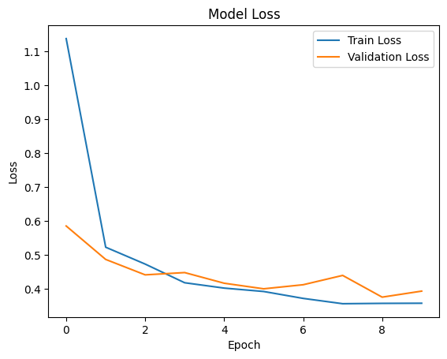
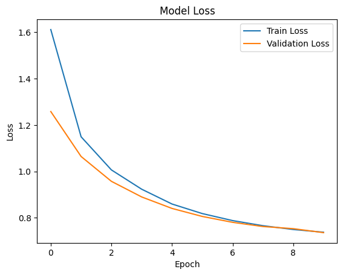

# Brain Tumor Classification using Transfer Learning

## Overview

This project extends a previous Convolutional Neural Network (CNN) model built from scratch for brain tumor classification. Here, I leverage **transfer learning** using several `tf.keras.applications` to enhance performance and reduce training time. The dataset used in this project consists of 3,762 preprocessed brain scan images, each with a resolution of (240, 240, 3). These images have already been converted into NumPy arrays, normalized with pixel values scaled to a range of 0 to 1, and split into training and testing sets. Both `train_data.npz` and `test_data.npz` contain the training and testing images (labeled X) and their corresponding labels (labeled Y).

This dataset was originally prepared as part of my summative project, where a CNN model was built from scratch for brain tumor classification. Now, we aim to compare ResNet50’s performance with other models in future iterations.

[Brain Tumor Classification Project](https://github.com/kayc0des/brain_tumor_model)

## Perfomance Metrics Across all Models

The table below summarizes the performance of ResNet50, VGG16 and EfficientNetB0 on the brain tumor classification dataset. I evaluated the model using standard metrics like accuracy, loss, precision, recall, and F1 score. 

| Model     | Accuracy | Loss  | Precision (No Tumor) | Precision (Tumor) | Recall (No Tumor) | Recall (Tumor) | F1 Score (No Tumor) | F1 Score (Tumor) |
|-----------|----------|-------|----------------------|-------------------|-------------------|----------------|---------------------|------------------|
| ResNet50  | 86.84% (85.05% val)  | 0.3588 (0.3934 val)| 0.92                 | 0.80              | 0.81              | 0.91           | 0.86                | 0.85             |
| EfficientNetB0 | 55.03% (53.32% val)   | 0.7437 (0.7357 val)| 0.56                 | 0.00              | 1.00              | 0.00           | 0.72                | 0.00             |

## ResNet50

ResNet50 is a powerful and widely used model in computer vision tasks due to its unique **residual learning** approach. Residual connections help the model overcome the **vanishing gradient problem**, making it capable of training deeper networks effectively. This ability to train deep layers is beneficial when working with complex image classification tasks like brain tumor detection, where subtle variations in the images can be crucial for accurate classification. Additionally, ResNet50 is pre-trained on a large dataset (ImageNet), allowing it to generalize better and extract relevant features when fine-tuned on a medical dataset like brain tumor scans.

### Key Training Results for ResNet50

- **Training Accuracy**: 86.84%
- **Training Loss**: 0.3588
- **Validation Accuracy**: 85.05%
- **Validation Loss**: 0.3934
- **Precision (No Tumor)**: 0.92, **Precision (Tumor)**: 0.80
- **Recall (No Tumor)**: 0.81, **Recall (Tumor)**: 0.91
- **F1 Score (No Tumor)**: 0.86, **F1 Score (Tumor)**: 0.85

## VGG16

### Key Training Results for VGG16

## EfficentNetB0

EfficientNetB0 is part of the EfficientNet family, known for its balance between model performance and efficiency. It scales three critical factors—depth, width, and resolution—proportionately, ensuring better accuracy with fewer parameters and computational requirements. However, in our case of brain tumor classification, the model struggled with classifying the 'Tumor' class effectively.

### Key Training Results for EfficientNetB0

- **Training Accuracy**: 55.03%
- **Training Loss**: 0.7437
- **Validation Accuracy**: 53.32%
- **Validation Loss**: 0.7357
- **Precision (No Tumor)**: 0.56, **Precision (Tumor)**: 0.00
- **Recall (No Tumor)**: 1.00, **Recall (Tumor)**: 0.00
- **F1 Score (No Tumor)**: 0.72, **F1 Score (Tumor)**: 0.00

---