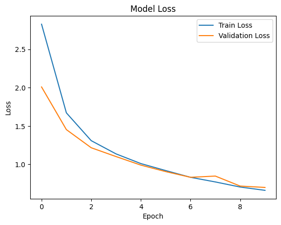

# Brain Tumor Classification using Transfer Learning

## Overview

This project extends a previous Convolutional Neural Network (CNN) model built from scratch for brain tumor classification. Here, I leverage **transfer learning** using several `tf.keras.applications` to enhance performance and reduce training time. The dataset used in this project consists of 3,762 preprocessed brain scan images, each with a resolution of (240, 240, 3). These images have already been converted into NumPy arrays, normalized with pixel values scaled to a range of 0 to 1, and split into training and testing sets. Both `train_data.npz` and `test_data.npz` contain the training and testing images (labeled X) and their corresponding labels (labeled Y).

This dataset was originally prepared as part of my summative project, where a CNN model was built from scratch for brain tumor classification. Now, we aim to compare ResNet50’s performance with other models in future iterations.

[Brain Tumor Classification Project](https://github.com/kayc0des/brain_tumor_model)

## Perfomance Metrics Across all Models

The table below summarizes the performance of ResNet50, VGG16 and EfficientNetB0 on the brain tumor classification dataset. I evaluated the model using standard metrics like accuracy, loss, precision, recall, and F1 score. 

| Model     | Accuracy | Loss  | Precision (No Tumor) | Precision (Tumor) | Recall (No Tumor) | Recall (Tumor) | F1 Score (No Tumor) | F1 Score (Tumor) |
|-----------|----------|-------|----------------------|-------------------|-------------------|----------------|---------------------|------------------|
| ResNet50  | 86.84% (85.05% val)  | 0.3588 (0.3934 val)| 0.92                 | 0.80              | 0.81              | 0.91           | 0.86                | 0.85             |
| VGG16 | 95.22% (92.19% val)   | 0.6606 (0.6990 val)| 0.90                 | 0.97              | 0.98              | 0.87           | 0.94                | 0.91             |
| EfficientNetB0 | 55.03% (53.32% val)   | 0.7437 (0.7357 val)| 0.56                 | 0.00              | 1.00              | 0.00           | 0.72                | 0.00             |

## ResNet50

ResNet50 is a powerful and widely used model in computer vision tasks due to its unique **residual learning** approach. Residual connections help the model overcome the **vanishing gradient problem**, making it capable of training deeper networks effectively. This ability to train deep layers is beneficial when working with complex image classification tasks like brain tumor detection, where subtle variations in the images can be crucial for accurate classification. Additionally, ResNet50 is pre-trained on a large dataset (ImageNet), allowing it to generalize better and extract relevant features when fine-tuned on a medical dataset like brain tumor scans.

### Architecture Rationale

Here’s why I selected ResNet50:

- `Depth with Skip Connections`: ResNet50 has 50 layers, which gives it the depth needed to capture detailed features in the brain tumor dataset. The residual (skip) connections help avoid the degradation problem, where deeper models can perform worse. This feature ensures that even with many layers, the model remains effective. This is especially important when working with medical images, where subtle details in brain scans are critical for accurate classification.

- `Feature Extraction Power`: By freezing the base layers (trainable=False), I can take advantage of the pre-trained weights from ImageNet. This allows the model to extract essential low- and mid-level features, such as edges, textures, and shapes, which are key to identifying tumor boundaries and anomalies in brain scans.

- `Regularization with L2`: The Dense layer with 64 neurons uses L2 regularization, which helps prevent overfitting—a common issue when working with medical datasets. By penalizing large weights, I ensure that the model generalizes better and doesn't rely too heavily on specific features in the training data.

- `ReLU Activation`: I chose the ReLU activation function for the Dense layer because it introduces non-linearity, which is necessary for learning complex patterns. This is particularly important for distinguishing between subtle differences in tumor and non-tumor images.

- `Output with Softmax`: The final Dense layer has 2 neurons, representing the two classes: Tumor and No Tumor. I used softmax activation to output class probabilities, which helps in interpreting the model’s predictions in terms of confidence.

### Key Training Results for ResNet50

- **Training Accuracy**: 86.84%
- **Training Loss**: 0.3588
- **Validation Accuracy**: 85.05%
- **Validation Loss**: 0.3934
- **Precision (No Tumor)**: 0.92, **Precision (Tumor)**: 0.80
- **Recall (No Tumor)**: 0.81, **Recall (Tumor)**: 0.91
- **F1 Score (No Tumor)**: 0.86, **F1 Score (Tumor)**: 0.85

## VGG16

### Architecture Rationale

Here’s why I selected VGG16:

- Architectural Depth: VGG16 features 16 layers (13 convolutional layers, dropped fully connected), providing sufficient depth to learn complex features from the brain tumor dataset. The uniformity and depth of VGG16 make it effective in capturing fine details in medical images, such as brain scans.

- Feature Extraction Power: The pre-trained weights from ImageNet are used by VGG16 to extract low- and mid-level features like edges and textures. By freezing the base layers (trainable=False), I leverage these features to detect patterns relevant to brain tumor classification.

**Custom Layers for Further Learning:**

- I added a Flatten layer to transform the 2D feature maps into a 1D feature vector suitable for dense layers.
The first Dense layer with 128 neurons and ReLU activation helps introduce non-linearity, enhancing the model’s ability to learn complex relationships in the data.

- A second Dense layer with 64 neurons and ReLU activation continues to refine feature learning, with L2 regularization applied to both dense layers to prevent overfitting. This regularization helps the model generalize better, especially given the relatively small size of medical datasets.

- The final Dense layer with 2 neurons uses softmax activation to provide class probabilities, crucial for binary classification of Tumor vs. No Tumor.

- Regularization with L2: The L2 regularization on the dense layers helps mitigate overfitting, which is important for maintaining model performance and generalization when training on medical image data.

- Output with Softmax: The softmax activation in the output layer allows the model to output probabilities for each class, providing a clear interpretation of its predictions in terms of confidence levels.

### Key Training Results for VGG16

- **Training Accuracy**: 95.22%
- **Training Loss**: 0.6606
- **Validation Accuracy**: 92.19%
- **Validation Loss**: 0.6990
- **Precision (No Tumor)**: 0.90, **Precision (Tumor)**: 0.97
- **Recall (No Tumor)**: 0.98, **Recall (Tumor)**: 0.87
- **F1 Score (No Tumor)**: 0.94, **F1 Score (Tumor)**: 0.91

## EfficentNetB0

EfficientNetB0 is part of the EfficientNet family, known for its balance between model performance and efficiency. It scales three critical factors—depth, width, and resolution—proportionately, ensuring better accuracy with fewer parameters and computational requirements. However, in our case of brain tumor classification, the model struggled with classifying the 'Tumor' class effectively.

### Key Training Results for EfficientNetB0

- **Training Accuracy**: 55.03%
- **Training Loss**: 0.7437
- **Validation Accuracy**: 53.32%
- **Validation Loss**: 0.7357
- **Precision (No Tumor)**: 0.56, **Precision (Tumor)**: 0.00
- **Recall (No Tumor)**: 1.00, **Recall (Tumor)**: 0.00
- **F1 Score (No Tumor)**: 0.72, **F1 Score (Tumor)**: 0.00

---